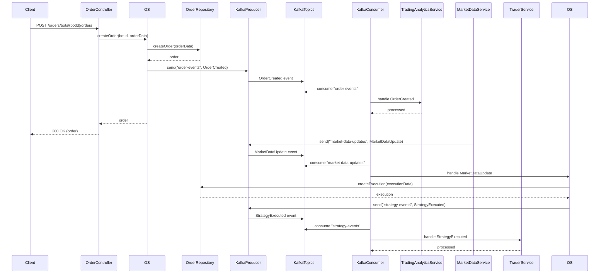

# Kafka Events for Order Service

## Overview

The Order Service uses Kafka as an event broker to enable asynchronous communication between different components of the trading platform. This document outlines the Kafka integration architecture, event types, and communication patterns used within the Order Service ecosystem.

## Architecture

The Kafka integration architecture consists of:

- **Event Publishers**: Components that emit events to Kafka topics
- **Event Consumers**: Services that subscribe to and process events from Kafka topics
- **Event Types**: Structured message formats for different types of events
- **Kafka Topics**: Categorized channels for event distribution

## Class Diagram

```mermaid
%% Class Diagram
classDiagram
    direction TB

    %% Order Service Components
    class OrderController {
        +createBot(traderId: string, botData: BotData) Bot
        +createOrder(botId: string, orderData: OrderData) Order
        +executeStrategy(botId: string, params: StrategyParams) Execution
        +cancelOrder(botId: string, orderId: string) Order
    }

    class OrderService {
        +createBot(traderId: string, botData: BotData) Bot
        +createOrder(botId: string, orderData: OrderData) Order
        +executeStrategy(botId: string, params: StrategyParams) Execution
        +cancelOrder(orderId: string) Order
        -publishEvent(event: Event) void
    }

    class OrderValidator {
        +validateOrder(order: OrderData) void
    }

    class OrderStateMachine {
        +transition(state: OrderState, action: Action) OrderState
    }

    class OrderRepository {
        +createOrder(order: OrderData) Order
        +updateOrder(orderId: string, updates: Partial~Order~) Order
        +createExecution(execution: ExecutionData) Execution
    }

    class ExchangeAdapter {
        <<interface>>
        +sendOrder(order: OrderData) ExchangeResponse
        +cancelOrder(orderId: string) ExchangeResponse
    }

    class DexAdapter {
        +sendOrder(order: OrderData) ExchangeResponse
        +cancelOrder(orderId: string) ExchangeResponse
    }

    %% Kafka Components
    class KafkaProducer {
        +send(topic: string, event: Event) void
    }

    class KafkaConsumer {
        +subscribe(topic: string, callback: Function) void
    }

    class KafkaTopics {
        +order-events
        +strategy-events
        +market-data-updates
    }

    class Event {
        +eventType: string
        +orderId?: string
        +botId?: string
        +status?: string
        +timestamp: string
    }

    class OrderCreated {
        +orderId: string
        +botId: string
        +status: string
    }

    class OrderStateChanged {
        +orderId: string
        +botId: string
        +status: string
    }

    class StrategyExecuted {
        +executionId: string
        +botId: string
        +strategy: string
    }

    class MarketDataUpdate {
        +pair: string
        +currentPrice: number
    }

    %% Data Models
    class Bot {
        +botId: string
        +strategy: string
        +exchangeId: string
        +pair: string
    }

    class Order {
        +orderId: string
        +botId: string
        +status: string
        +typeOrder: string
        +pair: string
        +quantity: number
    }

    class Execution {
        +executionId: string
        +botId: string
        +strategy: string
        +status: string
    }

    %% External Services
    class WalletService {
        +checkBalance(traderId: string, asset: string) Balance
    }

    class MarketDataService {
        +fetchPrice(pair: string) MarketData
        +publishMarketUpdate(update: MarketDataUpdate) void
    }

    class TradingAnalyticsService {
        +updateAnalytics(event: Event) void
    }

    class TraderService {
        +handleStrategyExecution(event: StrategyExecuted) void
    }

    class ProxyManagementService {
        +routeOrder(order: OrderData, adapter: ExchangeAdapter) ExchangeResponse
    }

    class PostgreSQL {
        +store(data: any) void
    }

    class Redis {
        +set(key: string, value: any) void
    }

    %% Relationships
    OrderController --> OrderService : delegates
    OrderService --> OrderValidator : uses
    OrderService --> OrderStateMachine : uses
    OrderService --> OrderRepository : persists
    OrderService --> KafkaProducer : publishes events
    OrderService --> ExchangeAdapter : routes orders
    DexAdapter ..|> ExchangeAdapter : implements
    OrderRepository --> PostgreSQL : stores
    OrderRepository --> Redis : caches
    OrderService --> WalletService : checks balance
    OrderService --> MarketDataService : fetches price
    MarketDataService --> KafkaProducer : publishes market updates
    TradingAnalyticsService --> KafkaConsumer : consumes events
    TraderService --> KafkaConsumer : consumes events
    OrderService --> ProxyManagementService : routes orders
    Order --> Bot : belongs to
    Execution --> Bot : belongs to
    KafkaProducer --> KafkaTopics : sends to
    KafkaConsumer --> KafkaTopics : subscribes to
    OrderCreated ..|> Event : inherits
    OrderStateChanged ..|> Event : inherits
    StrategyExecuted ..|> Event : inherits
    MarketDataUpdate ..|> Event : inherits
```

# Kafka Event-Driven Architecture for Trading System

## Components

### Event Publishers
- **OrderService**: Publishes events related to order lifecycle (creation, state changes, cancellation)
- **MarketDataService**: Publishes market data updates (price changes, volume changes)

### Event Consumers
- **TradingAnalyticsService**: Consumes order events to update analytics and performance metrics
- **TraderService**: Consumes strategy execution events to notify traders and trigger additional actions
- **OrderService**: Consumes market data updates to execute trading strategies

---

## Kafka Topics

| Topic | Description | Publishers | Consumers |
|-------|-------------|------------|-----------|
| order-events | Events related to order lifecycle | OrderService | TradingAnalyticsService |
| strategy-events | Events related to strategy execution | OrderService | TraderService |
| market-data-updates | Market price and volume updates | MarketDataService | OrderService |

---

## Event Types

| Event Type | Properties | Description |
|------------|------------|-------------|
| OrderCreated | orderId, botId, status | Emitted when a new order is created |
| OrderStateChanged | orderId, botId, status | Emitted when an order's state changes |
| StrategyExecuted | executionId, botId, strategy | Emitted when a trading strategy is executed |
| MarketDataUpdate | pair, currentPrice | Emitted when market prices change |

---

## Event Flow Scenarios

## Event Flow Scenarios

### Scenario 1: Order Creation
1. Client sends a request to create an order via the OrderController  
2. OrderService:
   - Creates the order in the OrderRepository
   - Publishes `OrderCreated` event to `order-events` topic
3. TradingAnalyticsService consumes the event and updates analytics  
4. OrderController returns the created order to the client  

### Scenario 2: Strategy Execution
1. MarketDataService:
   - Detects price change
   - Publishes `MarketDataUpdate` event  
2. OrderService:
   - Consumes the event
   - Determines strategy execution needed
   - Creates execution record in OrderRepository
   - Publishes `StrategyExecuted` event to `strategy-events` topic  
3. TraderService:
   - Consumes the event
   - Takes appropriate actions (notifications, etc.)

---

 

### 🧩 Decoupling
- Services evolve independently  
- Example: TradingAnalyticsService processes events without direct OrderService dependency  

### 📈 Scalability
- **Horizontal scaling**:
  - Multiple OrderService instances process different market data partitions  
  - Consumer groups enable efficient event distribution  

### 🛡️ Reliability
- Persistent, replicated events:
  - No data loss during consumer downtime  
  - Event replay capability for recovery/debugging  

### ⚡ Real-time Processing
- Instant reaction to market changes  
- Near real-time analytics updates  

---

## Implementation Considerations

### 🔄 Event Schema Evolution
- Use schema registry to manage compatibility  
- Support versioned event schemas  

### 📊 Monitoring Essentials
- Kafka consumer lag  
- Event processing errors  
- Topic throughput & latency  

### 🚨 Error Handling
- Dead-letter queues for failed events  
- Exponential backoff retry mechanisms  
- Circuit breakers to prevent cascades  

### 🔒 Security Measures
- **TLS** for encrypted communication  
- **SASL** for authentication  
- **ACLs** for topic-level authorization  
