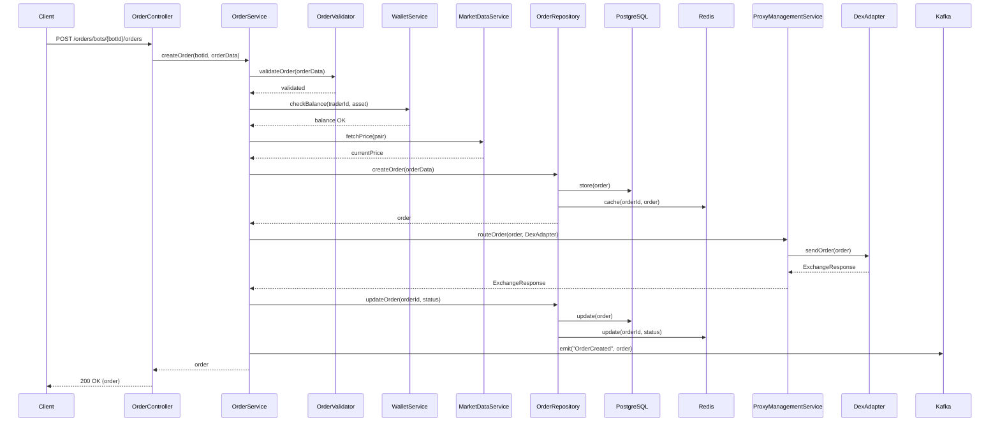

# Order Service

## Order Service structure 

```mermaid
    %% Class Diagram
    classDiagram
        direction TB

        %% Order Service Components
        class OrderController {
            +createBot(traderId: string, botData: BotData) Bot
            +getBot(botId: string) Bot
            +listBots(traderId: string, filters: Filters) Bot[]
            +startBot(botId: string) Bot
            +stopBot(botId: string) Bot
            +createOrder(botId: string, orderData: OrderData) Order
            +getOrder(botId: string, orderId: string) Order
            +amendOrder(botId: string, orderId: string, updates: OrderData) Order
            +cancelOrder(botId: string, orderId: string) Order
            +cancelAllOrders(botId: string) string[]
            +createManualOrder(orderData: OrderData) Order
            +executeManualOrder(orderId: string, action: string) Order
            +executeStrategy(botId: string, params: StrategyParams) Execution
            +getMarketData(pair: string) MarketData
            +getOrderAnalytics(botId: string, filters: Filters) Analytics
        }

        class OrderService {
            +createBot(traderId: string, botData: BotData) Bot
            +getBot(botId: string) Bot
            +listBots(traderId: string, filters: Filters) Bot[]
            +startBot(botId: string) Bot
            +stopBot(botId: string) Bot
            +createOrder(botId: string, orderData: OrderData) Order
            +getOrder(orderId: string) Order
            +amendOrder(orderId: string, updates: OrderData) Order
            +cancelOrder(orderId: string) Order
            +cancelAllOrders(botId: string) string[]
            +createManualOrder(orderData: OrderData) Order
            +executeManualOrder(orderId: string, action: string) Order
            +executeStrategy(botId: string, params: StrategyParams) Execution
        }

        class OrderValidator {
            +validateOrder(order: OrderData) void
            +validateBot(bot: BotData) void
            +validateStrategyParams(params: StrategyParams) void
        }

        class OrderStateMachine {
            +canAmend(state: OrderState) boolean
            +canCancel(state: OrderState) boolean
            +transition(state: OrderState, action: Action) OrderState
        }

        class OrderRepository {
            +createBot(bot: BotData) Bot
            +findBot(botId: string) Bot
            +findBots(filters: Filters) Bot[]
            +updateBot(botId: string, updates: Partial~Bot~) Bot
            +createOrder(order: OrderData) Order
            +findOrder(orderId: string) Order
            +findOrders(filters: Filters) Order[]
            +updateOrder(orderId: string, updates: Partial~Order~) Order
            +createExecution(execution: ExecutionData) Execution
        }

        class ExchangeAdapter {
            <<interface>>
            +sendOrder(order: OrderData) ExchangeResponse
            +modifyOrder(orderId: string, updates: OrderData) ExchangeResponse
            +cancelOrder(orderId: string) ExchangeResponse
            +fetchOrderStatus(orderId: string) ExchangeResponse
        }

        class DexAdapter {
            +sendOrder(order: OrderData) ExchangeResponse
            +modifyOrder(orderId: string, updates: OrderData) ExchangeResponse
            +cancelOrder(orderId: string) ExchangeResponse
            +fetchOrderStatus(orderId: string) ExchangeResponse
        }

        %% Data Models
        class Bot {
            +botId: string
            +traderId: string
            +botName: string
            +strategy: string
            +exchangeId: string
            +typeExchange: string
            +pair: string
            +base: string
            +quote: string
            +status: string
            +settings: StrategySettings
            +createdAt: string
            +updatedAt: string
        }

        class Order {
            +orderId: string
            +botId: string
            +status: string
            +typeOrder: string
            +side: string
            +pair: string
            +base: string
            +quote: string
            +quantity: number
            +price?: number
            +volume?: number
            +stopPrice?: number
            +slippage?: number
            +createdAt: string
            +updatedAt?: string
        }

        class Execution {
            +executionId: string
            +botId: string
            +strategy: string
            +status: string
            +executedAt: string
            +details: ExecutionDetails
        }

        %% External Dependencies
        class WalletService {
            +checkBalance(traderId: string, asset: string) Balance
        }

        class MarketDataService {
            +fetchPrice(pair: string) MarketData
        }

        class TradingAnalyticsService {
            +getAnalytics(filters: Filters) Analytics
        }

        class ProxyManagementService {
            +routeOrder(order: OrderData, adapter: ExchangeAdapter) ExchangeResponse
        }

        class Kafka {
            +emit(event: string, data: any) void
        }

        class PostgreSQL {
            +store(data: any) void
            +query(filters: Filters) any[]
        }

        class Redis {
            +set(key: string, value: any) void
            +get(key: string) any
        }

        %% Relationships
        OrderController --> OrderService : delegates
        OrderService --> OrderValidator : uses
        OrderService --> OrderStateMachine : uses
        OrderService --> OrderRepository : persists
        OrderService --> ExchangeAdapter : routes orders
        DexAdapter ..|> ExchangeAdapter : implements
        OrderRepository --> PostgreSQL : stores
        OrderRepository --> Redis : caches
        OrderService --> Kafka : emits events
        OrderService --> WalletService : checks balance
        OrderService --> MarketDataService : fetches price
        OrderService --> TradingAnalyticsService : fetches analytics
        OrderService --> ProxyManagementService : routes orders
        Order --> Bot : belongs to
        Execution --> Bot : belongs to

    
```

This diagram is designed to represent the structure of the service as part of a larger trading ecosystem, supporting bot-based and manual order management across centralized (CEX) and decentralized (DEX) exchanges.

## Order Service Architecture

This diagram represents the structure of the `OrderService` as part of a larger trading ecosystem, supporting bot-based and manual order management across centralized (CEX) and decentralized (DEX) exchanges.

### Components

*OrderController*: Acts as the entry point for API requests.
  *Handles endpoints for creating bots, managing orders, and executing strategies.
  *Delegates business logic to the `OrderService`, ensuring a clean separation of concerns between presentation and processing layers.
*OrderService*: The core business logic layer.
  *Responsible for orchestrating order lifecycle management (creation, modification, cancellation), bot operations (start/stop), and strategy execution (Counter, Limit, Volume, Floating).
  *Interacts with external services like `WalletService`, `MarketDataService`, and `TradingAnalyticsService`.
  *Routes orders via `ProxyManagementService`.
*OrderValidator*: Ensures data integrity.
  *Validates order parameters (e.g., quantity, price, slippage), bot configurations, and strategy settings before processing.
*OrderStateMachine*: Manages the state transitions of orders (e.g., `PENDING` to `FILLED`).
  *Enforces rules for actions like amendment or cancellation based on the current state.
*OrderRepository*: Handles data persistence and caching.
  *Interfaces with PostgreSQL for long-term storage and Redis for fast access to order and bot data.
  *Supports CRUD operations for bots, orders, and execution records.
*ExchangeAdapter*: An interface defining the contract for exchange interactions (send, modify, cancel, fetch status).
  *Implemented by specific adapters (e.g., `DexAdapter`) to support diverse exchange types.
*DexAdapter*: A concrete implementation of `ExchangeAdapter`.
  *Tailored for DEX platforms (e.g., Uniswap, PancakeSwap, Raydium, STON).
  *Handles blockchain-based order execution.
*Data Models (Bot, Order, Execution)*: Represent the entities managed by the service.
  *Attributes include `botId`, `orderId`, `status`, and strategy-specific settings.
  *Link orders to bots and track executions.
*External Dependencies*: Highlight the service's integration points.
  *`WalletService` (balance checks)
  *`MarketDataService` (price feeds)
  *`TradingAnalyticsService` (analytics)
  *`ProxyManagementService` (order routing)
  *`Kafka` (event emission)
  *`PostgreSQL` (data storage)
  *`Redis` (caching)

### Relationships

* The `OrderController` delegates to `OrderService`.
* `OrderService` uses `OrderValidator`, `OrderStateMachine`, `OrderRepository`, and `ExchangeAdapter` for its operations.
* `DexAdapter` implements `ExchangeAdapter`.
* `OrderRepository` interacts with `PostgreSQL` and `Redis`.
* `OrderService` communicates with external services and emits events via `Kafka`.
* `Order` and `Execution` entities are associated with `Bot`, reflecting their hierarchical structure.

## Order Creation Flow

This section describes the sequence of actions when a new order is created.

### Participants

* *Client*: The external entity (e.g., a trader's application) initiating the order creation request.
* *OrderController*: Receives the HTTP request and forwards it to the business logic layer.
* *OrderService*: Coordinates the order creation process, validating data, checking resources, and routing the order.
* *OrderValidator*: Validates the order's parameters to ensure they meet business rules.
* *WalletService*: Verifies the trader's balance to confirm sufficient funds.
* *MarketDataService*: Provides current market price data for order validation or strategy adjustment.
* *OrderRepository*: Manages persistence and caching of the order data.
* *PostgreSQL*: Stores the order in the database.
* *Redis*: Caches the order for quick access.
* *ProxyManagementService*: Routes the order to the appropriate exchange adapter.
* *DexAdapter*: Executes the order on a DEX (e.g., Uniswap, PancakeSwap) via blockchain transactions.
* *Kafka*: Emits events to notify other services of the order's creation.

### Flow Steps

1. The *Client* sends a `POST /orders/bots/{botId}/orders` request to the *OrderController*.
2. The *OrderController* delegates the request to the *OrderService*.
3. The *OrderService* calls the *OrderValidator* to validate the order data, receiving confirmation.
4. The *OrderService* queries the *WalletService* to check the trader's balance, receiving a positive response.
5. The *OrderService* fetches the current price from the *MarketDataService*.
6. The *OrderService* instructs the *OrderRepository* to create the order.
   * The *OrderRepository* stores it in *PostgreSQL* and caches it in *Redis*.
   * The *OrderRepository* then returns the order object.
7. The *OrderService* routes the order to the *ProxyManagementService*, which forwards it to the *DexAdapter* for execution.
8. The *DexAdapter* processes the order (e.g., via a blockchain swap) and returns an `ExchangeResponse` to the *ProxyManagementService*.
9. The *ProxyManagementService* relays the response to the *OrderService*.
10. The *OrderService* updates the order status via the *OrderRepository*, which updates *PostgreSQL* and *Redis*.
11. The *OrderService* emits an "OrderCreated" event to *Kafka*.
12. The *OrderService* returns the order to the *OrderController*, which sends a 200 OK response with the order details to the *Client*.

## User flow with Order service

